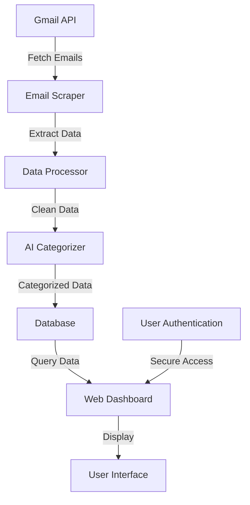
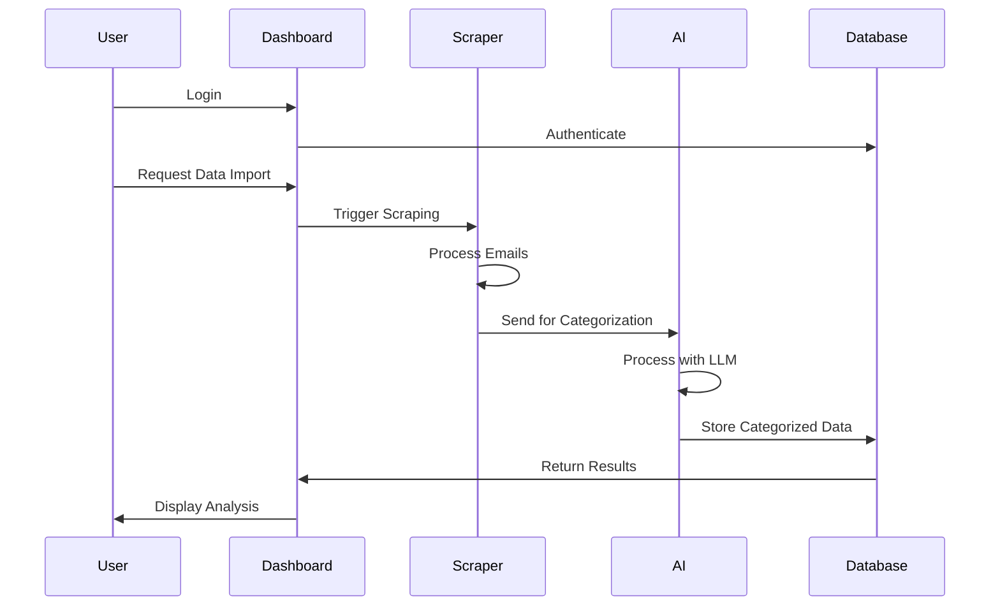
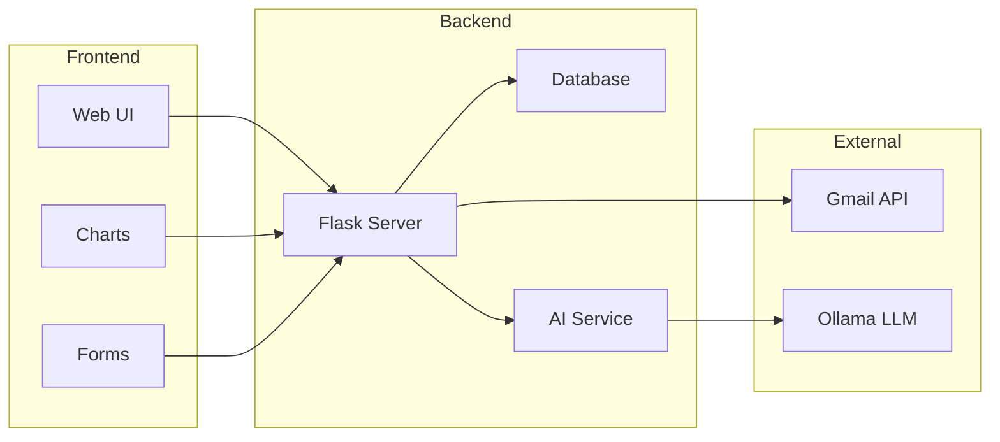
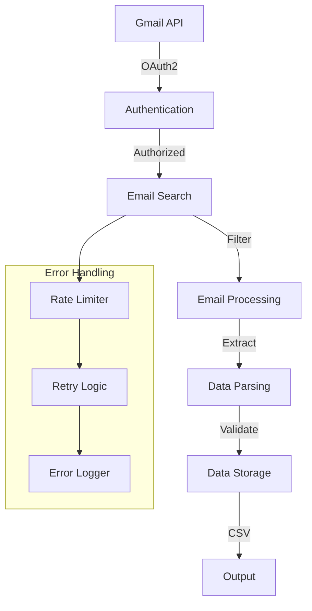
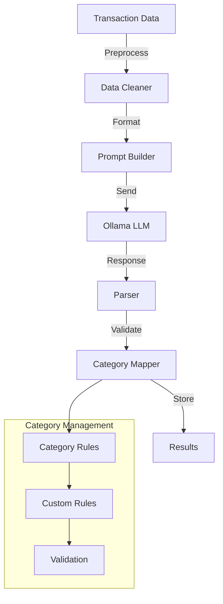
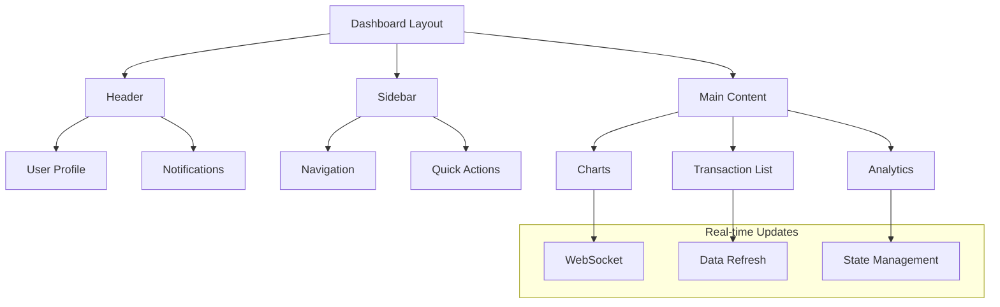
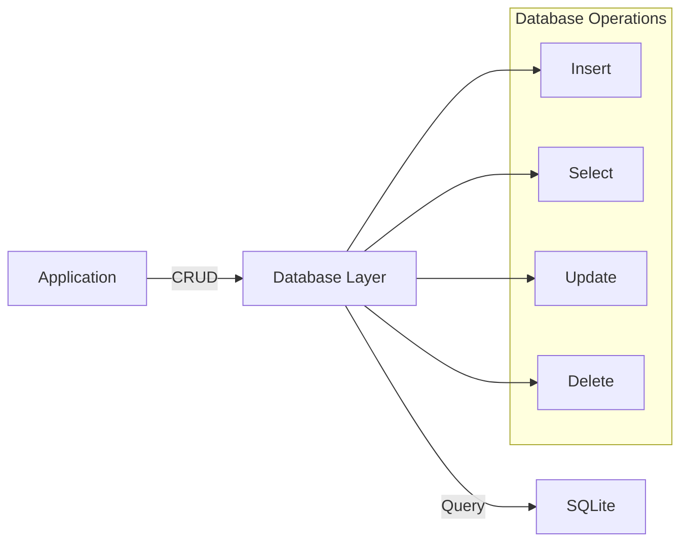

# Expense Tracking and Analysis System
## Project Report

### Executive Summary
This project implements an intelligent expense tracking and analysis system that automatically scrapes transaction data from Gmail, categorizes expenses using AI, and presents insights through a web-based dashboard. The system integrates multiple technologies to provide a seamless experience for users to track and analyze their spending patterns.

### Table of Contents
1. [Project Overview](#project-overview)
2. [System Architecture](#system-architecture)
3. [Technical Components](#technical-components)
4. [Features and Functionality](#features-and-functionality)
5. [Implementation Details](#implementation-details)
6. [Security Considerations](#security-considerations)
7. [Future Enhancements](#future-enhancements)

### Project Overview

#### Purpose
The system aims to automate the process of expense tracking by:
- Automatically collecting transaction data from email notifications
- Intelligently categorizing expenses using AI
- Providing visual insights through an interactive dashboard
- Enabling users to track and analyze their spending patterns

#### Target Users
- Individuals looking to track personal expenses
- Small business owners managing business transactions
- Anyone using PhonePe for digital payments

### System Architecture

#### High-Level Architecture
```
[Gmail] → [Scraper] → [Data Processing] → [AI Analysis] → [Web Dashboard]
```

#### Component Breakdown
1. **Data Collection Layer**
   - Gmail API Integration
   - Email Scraping Module
   - Data Storage (CSV)

2. **Processing Layer**
   - Data Cleaning
   - AI Categorization
   - Visualization Generation

3. **Presentation Layer**
   - Web Dashboard
   - Interactive Visualizations
   - User Authentication

### Technical Components

#### 1. Web Application (Flask)
- **Framework**: Flask
- **Database**: SQLite
- **Authentication**: Custom implementation with password hashing
- **Frontend**: HTML/CSS/JavaScript

#### 2. Email Scraping System
- **API**: Gmail API
- **Authentication**: OAuth2
- **Data Processing**: Regular Expressions
- **Storage**: CSV format

#### 3. AI Analysis System
- **AI Model**: Ollama (LLM)
- **Categorization**: Custom prompt-based system
- **Visualization**: Matplotlib
- **Report Generation**: DeepSeek API

### Features and Functionality

#### 1. User Management
- User registration and login
- Secure password handling
- Session management
- Profile management

#### 2. Transaction Processing
- Automatic email scraping
- Transaction data extraction
- Data cleaning and normalization
- CSV export functionality

#### 3. Expense Analysis
- AI-powered categorization
- Expense visualization
- Category-wise analysis
- Trend analysis

#### 4. Dashboard Features
- Real-time transaction display
- Interactive charts
- Category-wise breakdown
- Export capabilities

### Implementation Details

#### Data Flow
1. **Email Collection**
   ```python
   # Gmail API integration
   service = build('gmail', 'v1', credentials=creds)
   results = service.users().messages().list(userId='me', q=search_query).execute()
   ```

2. **Transaction Processing**
   ```python
   # Transaction extraction
   amount, recipient, transaction_type = extract_phonepe_details(messageBody)
   ```

3. **AI Categorization**
   ```python
   # AI-based categorization
   response = ollama.chat(model='llama3', messages=[{"role": "user", "content": prompt}])
   ```

4. **Visualization**
   ```python
   # Data visualization
   plt.figure(figsize=(10, 6))
   plt.bar(categories.keys(), categories.values())
   ```

### Security Considerations

#### Implemented Security Measures
1. **Authentication**
   - Password hashing using Werkzeug
   - OAuth2 for Gmail API
   - Session-based authentication

2. **Data Protection**
   - Secure API key handling
   - Input validation
   - Error handling

3. **Access Control**
   - User-specific data access
   - Protected routes
   - Secure session management

### Future Enhancements

#### Planned Improvements
1. **Technical Enhancements**
   - Implement caching system
   - Add rate limiting
   - Enhance error handling
   - Improve logging system

2. **Feature Additions**
   - Multiple email provider support
   - Advanced analytics
   - Budget planning
   - Export to multiple formats

3. **User Experience**
   - Mobile-responsive design
   - Dark mode support
   - Customizable dashboards
   - Notification system

### Conclusion
The Expense Tracking and Analysis System successfully implements an automated solution for expense tracking and analysis. The integration of Gmail API, AI categorization, and web-based visualization provides users with a comprehensive tool for managing their expenses. The modular architecture allows for easy maintenance and future enhancements.

### Technical Requirements

#### System Requirements
- Python 3.x
- Flask
- Gmail API credentials
- Ollama AI model
- DeepSeek API access

#### Dependencies
```
flask
flask-sqlalchemy
google-auth-oauthlib
google-api-python-client
pandas
matplotlib
ollama
requests
pyyaml
```

### Installation and Setup
1. Clone the repository
2. Install dependencies:
   ```bash
   pip install -r requirements.txt
   ```
3. Set up Gmail API credentials
4. Configure environment variables
5. Initialize the database:
   ```bash
   flask db init
   flask db migrate
   flask db upgrade
   ```

### Usage Instructions
1. Start the Flask application:
   ```bash
   python flask_app/app.py
   ```
2. Access the web dashboard at `http://localhost:5000`
3. Register/login to access the system
4. Allow Gmail API access when prompted
5. View and analyze your expenses

### Support and Maintenance
For technical support or questions, please contact the development team or refer to the project documentation.

### Detailed Component Documentation

#### 1. Gmail Scraping System

##### Architecture
```
[Gmail API] → [Authentication] → [Email Processing] → [Data Extraction] → [CSV Storage]
```

##### Key Components
1. **Authentication Module**
   ```python
   # OAuth2 Authentication Flow
   SCOPES = ['https://www.googleapis.com/auth/gmail.readonly']
   creds = Credentials.from_authorized_user_file('token.json', SCOPES)
   ```

2. **Email Processing**
   - Searches for PhonePe transaction emails
   - Handles multiple email formats
   - Processes both plain text and HTML content
   - Extracts transaction details using regex patterns

3. **Data Extraction Patterns**
   ```python
   # Example regex patterns
   paid_to_pattern = r'(?:Paid to|Paid)\s+(.*?)(?=\s*(?:₹|Rs\.?|\s+Txn\.|\s+on|\s+at|$))'
   amount_pattern = r'(?:₹|Rs\.?)\s*(\d+(?:,\d{3})*(?:\.\d{2})?)'
   ```

4. **Error Handling**
   - Invalid email formats
   - API rate limits
   - Network connectivity issues
   - Data parsing errors

#### 2. AI Categorization System

##### Architecture
```
[Transaction Data] → [AI Processing] → [Category Mapping] → [Result Generation]
```

##### Components
1. **Prompt Engineering**
   ```python
   # Example prompt template
   prompt_template = """
   Categorize the following expenses into predefined categories:
   {expenses}
   
   Available categories:
   {categories}
   """
   ```

2. **Category Management**
   - YAML-based category definitions
   - Custom category rules
   - Category hierarchy support

3. **AI Model Integration**
   - Ollama LLM configuration
   - Response parsing
   - Error handling
   - Fallback mechanisms

4. **Result Processing**
   - JSON response parsing
   - Category validation
   - Confidence scoring
   - Result caching

#### 3. Web Dashboard

##### Architecture
```
[Flask Server] → [Database Layer] → [Template Engine] → [Frontend]
```

##### Components
1. **User Interface**
   - Responsive design
   - Interactive charts
   - Real-time updates
   - Mobile optimization

2. **Data Visualization**
   ```python
   # Chart generation
   def generate_charts(data):
       # Bar chart for category distribution
       plt.figure(figsize=(10, 6))
       plt.bar(data['categories'], data['amounts'])
       
       # Pie chart for expense distribution
       plt.figure(figsize=(8, 8))
       plt.pie(data['amounts'], labels=data['categories'])
   ```

3. **Real-time Updates**
   - WebSocket integration
   - AJAX polling
   - Data refresh mechanisms
   - State management

4. **Export Functionality**
   - CSV export
   - PDF report generation
   - Data backup
   - Custom report templates

#### 4. Database Schema

##### User Table
```sql
CREATE TABLE user (
    id INTEGER PRIMARY KEY AUTOINCREMENT,
    username VARCHAR(80) UNIQUE NOT NULL,
    email VARCHAR(120) UNIQUE NOT NULL,
    password VARCHAR(120) NOT NULL,
    created_at TIMESTAMP DEFAULT CURRENT_TIMESTAMP
);
```

##### Transaction Table
```sql
CREATE TABLE transaction (
    id INTEGER PRIMARY KEY AUTOINCREMENT,
    date DATE NOT NULL,
    description VARCHAR(120) NOT NULL,
    category VARCHAR(50) NOT NULL,
    amount FLOAT NOT NULL,
    balance FLOAT NOT NULL,
    user_id INTEGER,
    FOREIGN KEY (user_id) REFERENCES user(id)
);
```

#### 5. API Endpoints

##### Authentication
```
POST /login
- Purpose: User authentication
- Parameters: email, password
- Returns: JWT token

POST /register
- Purpose: New user registration
- Parameters: username, email, password
- Returns: Success message
```

##### Transaction Management
```
GET /transactions
- Purpose: Fetch user transactions
- Parameters: start_date, end_date, category
- Returns: Transaction list

POST /transactions/import
- Purpose: Import transactions from email
- Parameters: None
- Returns: Import status
```

##### Analytics
```
GET /analytics/categories
- Purpose: Get category-wise analysis
- Parameters: period
- Returns: Category distribution

GET /analytics/trends
- Purpose: Get spending trends
- Parameters: period
- Returns: Trend data
```

#### 6. Error Handling System

##### Error Types
1. **Authentication Errors**
   - Invalid credentials
   - Expired sessions
   - Missing permissions

2. **API Errors**
   - Rate limiting
   - Network issues
   - Invalid responses

3. **Data Processing Errors**
   - Invalid formats
   - Missing data
   - Parsing errors

##### Error Handling Implementation
```python
try:
    # Process data
    result = process_data(data)
except ValidationError as e:
    # Handle validation errors
    log_error(e)
    return error_response(e)
except APIError as e:
    # Handle API errors
    retry_with_backoff()
except Exception as e:
    # Handle unexpected errors
    log_critical(e)
    return generic_error()
```

#### 7. Security Implementation

##### Password Security
```python
# Password hashing
def hash_password(password):
    return generate_password_hash(password, method='pbkdf2:sha256')

# Password verification
def verify_password(hash, password):
    return check_password_hash(hash, password)
```

##### API Security
- Rate limiting
- Request validation
- CORS configuration
- Input sanitization

##### Data Protection
- Encryption at rest
- Secure transmission
- Access control
- Audit logging 

### System Diagrams and Visual Representations

#### 1. Overall System Architecture


#### 2. Data Flow Diagram


#### 3. Component Interaction


### Enhanced Component Details

#### 1. Gmail Scraping System

##### Detailed Architecture


##### Email Processing Pipeline
1. **Email Search**
   ```python
   search_query = """
   (from:support@phonepe.com OR 
    from:no-reply@phonepe.com OR 
    from:noreply@phonepe.com OR 
    subject:PhonePe) 
   after:{date}
   """
   ```

2. **Content Extraction**
   ```python
   def extract_content(message):
       if message.is_multipart():
           for part in message.get_payload():
               if part.get_content_type() == 'text/plain':
                   return part.get_payload()
       return message.get_payload()
   ```

3. **Data Validation**
   ```python
   def validate_transaction(data):
       required_fields = ['amount', 'recipient', 'date']
       return all(field in data for field in required_fields)
   ```

#### 2. AI Categorization System

##### Detailed Architecture


##### Category Management System
1. **Category Definition**
   ```yaml
   categories:
     - name: "Food & Dining"
       description: "Restaurants, groceries, and food-related expenses"
       keywords: ["restaurant", "food", "grocery", "cafe"]
       rules:
         - type: "keyword_match"
           value: ["restaurant", "cafe"]
         - type: "amount_range"
           min: 0
           max: 10000
   ```

2. **Rule Processing**
   ```python
   def apply_category_rules(transaction, category):
       for rule in category['rules']:
           if rule['type'] == 'keyword_match':
               if not any(keyword in transaction['description'].lower() 
                         for keyword in rule['value']):
                   return False
           elif rule['type'] == 'amount_range':
               if not (rule['min'] <= transaction['amount'] <= rule['max']):
                   return False
       return True
   ```

#### 3. Web Dashboard

##### UI Component Architecture


##### Chart Generation System
```python
class ChartGenerator:
    def __init__(self):
        self.chart_types = {
            'bar': self.generate_bar_chart,
            'pie': self.generate_pie_chart,
            'line': self.generate_line_chart
        }
    
    def generate_chart(self, data, chart_type):
        if chart_type in self.chart_types:
            return self.chart_types[chart_type](data)
        raise ValueError(f"Unsupported chart type: {chart_type}")
    
    def generate_bar_chart(self, data):
        plt.figure(figsize=(10, 6))
        plt.bar(data['categories'], data['amounts'])
        plt.title('Expense Distribution by Category')
        plt.xlabel('Categories')
        plt.ylabel('Amount')
        return plt.gcf()
```

#### 4. Database Operations

##### Data Flow Diagram


##### Transaction Processing
```python
class TransactionProcessor:
    def __init__(self, db_session):
        self.session = db_session
    
    def process_transaction(self, transaction_data):
        try:
            # Validate transaction data
            if not self.validate_transaction(transaction_data):
                raise ValueError("Invalid transaction data")
            
            # Create transaction record
            transaction = Transaction(
                date=transaction_data['date'],
                description=transaction_data['description'],
                category=transaction_data['category'],
                amount=transaction_data['amount'],
                balance=transaction_data['balance']
            )
            
            # Save to database
            self.session.add(transaction)
            self.session.commit()
            
            return transaction
        except Exception as e:
            self.session.rollback()
            raise e 